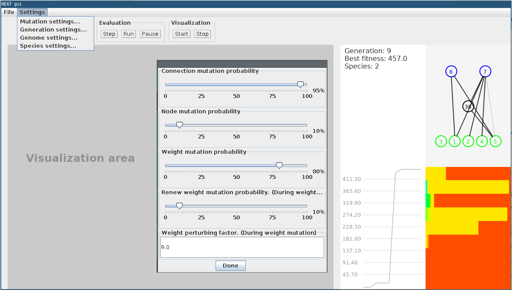

# NEAT GUI

Graphic visualization library for the [NEAT](https://github.com/FelixStridsberg/neat) project.

_(This is a separate project because GUI is boring so I always make it messy. Trying to avoid mess in the main project.)_

For example usage, see the [neat-race](https://github.com/FelixStridsberg/neat-race) project.

## Screenshot

